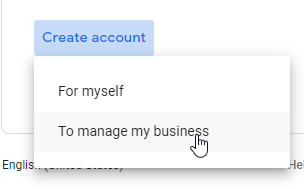

# Creating a Google Android Enterprise Account
Android Enterprise is now the primary enrollment method for all Android devices. This enables the "Work Profile" feature on most modern Android Devices. Before we can run through Enterprise Enrollment, we'll need you to create an Android Enterpise Account.

## Important Tips
- Use a unique account for each customer.
- When you sign up, you'll need to use a valid email address.
- Use an InPrivate or Incognito window when completing these steps.

## Procedure
1. Go to the [Android Enterprise](https://android.com/enterprise) website
2. Click the "Get Started" button in the top right corner

3. Click the blue **Sign In** button at the top right
4. Click the **Create account** button
7. Choose **to manage by business**

6. Enter the information requested to create an account, and follow the remainder of the instructions provided to create the Google Account, *including email verification*.

**Please save the credentials in a safe place. They will be needed during your advisory and/or implementation services~**